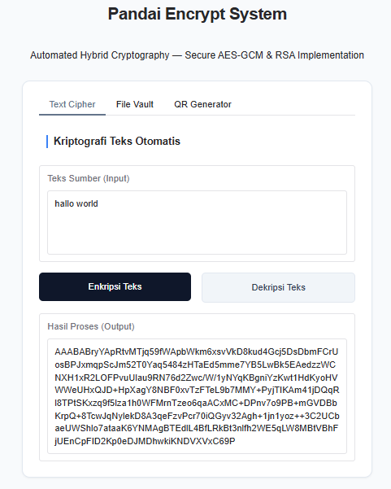
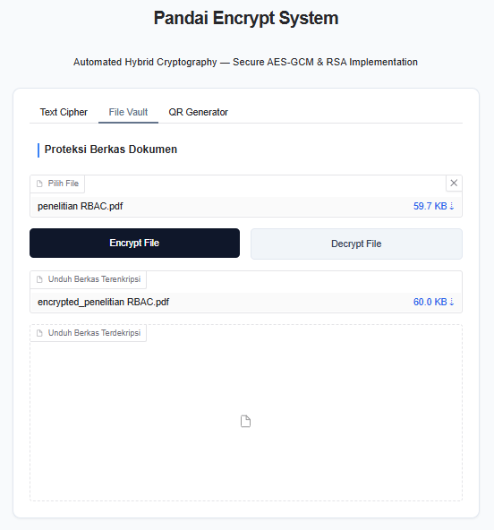
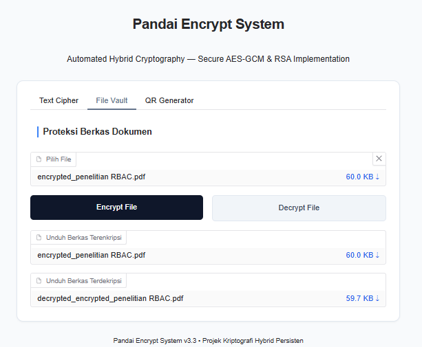
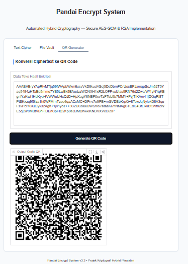

# Pandai Encrypt System

Aplikasi web berbasis Python yang mengimplementasikan Hybrid Cryptography menggunakan AES-GCM 256-bit dan RSA 2048-bit untuk mengamankan teks maupun dokumen. Sistem dilengkapi dengan QR Code Generator dan antarmuka interaktif menggunakan Gradio.

## Features

* Enkripsi teks menggunakan AES-GCM 256-bit
* Dekripsi teks secara aman
* Enkripsi dan dekripsi dokumen
* Implementasi Hybrid Cryptography (AES + RSA)
* QR Code Generator
* Antarmuka web menggunakan Gradio

## Tech Stack

* Python
* Gradio
* Cryptography
* AES-GCM
* RSA 2048-bit

## Installation

```bash
git clone https://github.com/irgikurniawann-glitch/Pandai-Encrypt-System.git
cd Pandai-Encrypt-System

pip install -r requirements.txt
python app.py
```

## Demo
Main Interface




File Encryption Result




File Decryption Result




QR Code Generator




## Learning Outcomes

* Memahami implementasi Hybrid Cryptography menggunakan AES-GCM dan RSA.
* Mengembangkan aplikasi web interaktif menggunakan Gradio.
* Mengimplementasikan proses enkripsi dan dekripsi untuk teks serta dokumen.

## Author

Irgi Kurniawan
